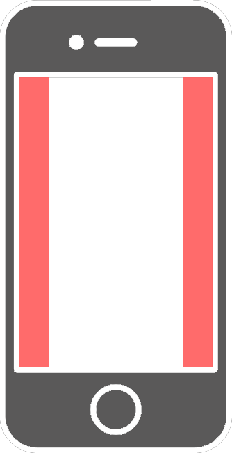
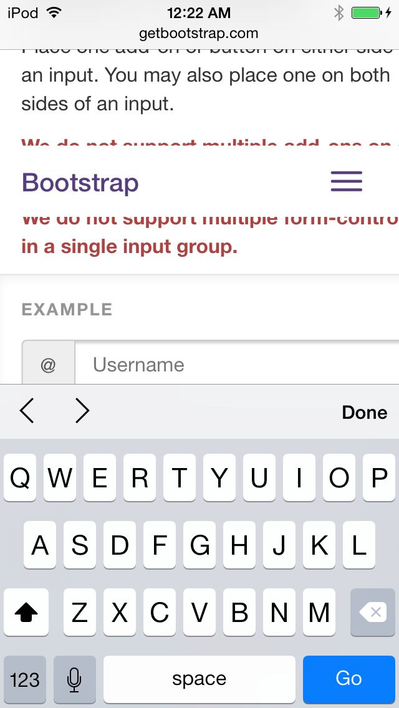

  This is a list of guidelines I've been compiling over the last couple years while
building high-performance mobile frontends.  Some of these are broadly
applicable to any mobile website, some are specifically for people building
apps.

I've broken this checklist down into three main categories:
1) UX and UI
2) Performance
3) Homescreen and Offline

##UX and UI

###Don't put touch interactions too close to edges of the screen.

  Unfortunately, mobile web apps are considered second class citizens relative
to native apps. They're frequently overridden by browser default touch
interactions that you can't disable.  The "swipe from left" gesture that
triggers the back button in Safari is the worst offender.  On Android, swipe
interactions that start too close to the bottom of the screen will cause Google
Now to activate.  When you're designing your app, ensure that there is enough
margin between the main content container and the sides of the screen that even
the fattest of fingers won't accidentally trigger the host browser or OS's edge
swipe gestures.



###Remove the click delay

  When you tap something on the mobile web, default behavior results in a 300ms
delay between when you tap and when the event fires.  This has been fixed on
android 4.4+, but is still an issue on iOS.  The solution is to use a library
like fastClick.

  FastClick detects when the user's finger leaves the screen, via touchend
events, and immediately fires click events without the delay inherent in the
default behavior.

###Better fixed header when input is focused.

  How much do you hate it when your fixed header unfixes itself any time the
user brings up their onscreen keyboard? A lot? Me too.

  The solution is to not actually fix your header over top of the content.
Instead, put the content in an `absolute`-positioned container with overflow
scroll.

  Then put the header in a sibling container that is also `absolute`.  This
way, scrolling the content doesn't actually affect the header at all since
neither are fixed over top of each other.  This technique also works well with
the next technique for Preventing Overscroll.

  WARNING: This will cause the double tap at the top of mobile safari to no
  longer scroll to the top of the page, since it's no longer the body scrolling.



###Prevent overscroll on the body.

  If you want your web app to feel app-like, you have to get rid of overscroll.
Overscroll is what occurs when a user is able to pull a scroll container past
it's boundary.  When this happens on the body element, an ugly grey background
appears and the entire viewport shifts.

  You can fix this really easily in cordova/phonegap with this simple xml config.

  ```
  <preference name="DisallowOverscroll" value="true" />
  ```

  It's also possible to fix this issue in plain javascript. An example is
available at [this repo](https://github.com/luster-io/prevent-overscroll).


###Make things that shouldn't be selectable, unselectable

  It's really annoying when a user trying to interact with an element causes
the element, or the text within it, to be selected instead. Adding
`user-select: none` to everything, except for the things that a user would
genuinely want to copy paste can cut way down on these interactions being
accidentally triggered.

  Adding `-webkit-touch-callout: none;` to a thing prevents a tap and hold from
open a context menu on the link or image.

  ```css
  user-select: none;
  -{prefix}-user-select: none;
  -webkit-touch-callout: none;
  ```

```javascript
if(navigator.userAgent.match(/Android/i))
  window.addEventListener('contextmenu', function (e) { e.preventDefault() })
```

###Always use momentum scrolling.

  Now that our scrolling is in a seperate container, it lost its momentum! To
get it back, we have to add `-webkit-overflow-scrolling: touch;` to the
container with `overflow: scroll` on it. This gives the element momentum
scrolling, instead of ending the scroll the moment the user takes their finger
off the page.

###Get rid of ugly grey tap highlight.

  By default, mobile web browsers display a tap highlight, so that users get
feedback when they tap something.  Unfortunately it looks awful and is a dead
giveaway that your app isn't native.

  The really easy solution is to add this to your css.  You NEVER want
the default highlight.

  ```css
  * {
    -webkit-tap-highlight-color: rgba(0,0,0,0);
  }
  ```


###Use `:active` states or add active classes

  So we got rid of the tap highlight color. Now we need to give users feedback
when they tap something that's tappable.

  The easy way to do this is to add `:active` states to tappable things.

  ```
  button:active {
    /* some example */
  }
  ```

###Hide chrome when your app is added to the homescreen.

  If someone likes your app enough to add it to their homescreen, why not make
the experience even better for them?  You can remove the address bar, forward
and back button, and other miscellaneous browser controls with a few meta tags.

  ```html
  <!-- android -->
  <meta name="mobile-web-app-capable" content="yes">
  <!-- iOS -->
  <meta name="apple-mobile-web-app-capable" content="yes">
  <meta name="apple-mobile-web-app-status-bar-style" content="translucent-black">
  <meta name="apple-mobile-web-app-title" content="My App">
  ```

###Hide with opacity or translate off screen if you plan to animate an element

  If you have an element that needs to be able to appear onscreen in a moment's
notice, don't just `display: none;` it.  If you do, it will have to be painted
before it can appear.  So, for things like hidden menus, it's best to hide them
by setting `opacity` to `0` or by translating the item off screen
(`translate3d(-9999px, 0, 0)`.  That way it's painted, loaded on the GPU, and
ready to go, and won't have an initial jank, when you pull it onscreen.


###Don't use a custom scroll implementation unless you REALLY need to.

  But you shouldn't need to.

  Unless you're trying to do something crazy fancy like paralax.  Or you want
things to whizz, spin, or spring in as the user scrolls down.  However, I've
never seen entrance effects or paralax done well on mobile, so be prepared for
it not to work out.  The danger is that not only do your neat effects jank, but
your scrolling janks out along with them.

  There are a few reasons why it wouldn't work.  Even though you can build
scrolling that feels very similar to native with something like Impulse, there
are still problems with implementing your own scrolling.  One is that you're
limiting the length of your content.  Mobile browsers do some crazy things to
make scrolling smooth.  They only load some of the painted content, and
asyncronously paint and load the content in.  If you do scrolling yourself, you
don't get that.  Your scrollable area has to fit entirely into gpu memory.  If
it doesn't you're going to have to paint portions of it as you scroll, and
there is no way that's going to be smooth.

###Prevent user scaling.

  If you're building an app that you want to feel native, you probably don't
want to allow the user to arbitrarily zoom in and out.

  ```
  <meta name="viewport" content="width=device-width,height=device-height,user-scalable=no,initial-scale=1.0,maximum-scale=1.0,minimum-scale=1.0">
  ```

  If you use this meta tag, it will prevent the user from scaling and will also
prevent scaling due to input focus and scaling due to device orientation.


###Test your back and forward buttons and linkability

  Even though your app provides it's own navigation, you can't just ignore the
browser's default navigation. Not to mention, if you launch your app on HN, the
top comments will revolve around the fact that your app breaks back button
functionality.  Learn to use pushState, or find a framework that handles it for
you.

### IE cleartype.

  You can turn cleartype on in IE-based browsers so that text in your mobile app looks nicer on the small screen.

  ```
  <meta http-equiv="cleartype" content="on">
  ```

## Performance

###Performance First
  It's much easier to build something that's performant from day one, than
  to build something that "works" and then trying to optimize it.  If something isn't performing, try to understand right away, before you have multiple confounding performance issues that are nearly impossible to debug, or have become integral to the way your app functions.

###Only animate transforms, opacity, and filter.

  This is a big one.  Animating properties like width, height, box-shadow, or
anything that isn't `transform` `opacity` or `filter` is not advised.
Animating any other property will cause repaints and/or reflows that will tank
performance.  Your desktop maybe be powerful enough to handle repainting your
page as it changes 60 times per second, but your users' phones will not be,
resulting in an app that feels sluggish and unresponsive.

###Add translateZ or will-change to animated elements.

  To improve the performance of your animations, add `transform: translateZ`
and/or `will-change: transform` or `will-change: opacity`  This lets the
browser know that you're going to be animating this property and that it should
upload a layer to be composited on the GPU.

###Don't use jquery animate or fade.

  Jquery Animate uses a setInterval instead of requestAnimationFrame, and
doesn't have good support for animating css transforms, which are bascically
the only thing you can safely animate on mobile (except opacity). Just use CSS
animations, transitions, Velocityjs and/or Impulse.

###Don't resize images clientside.

  When on a mobile device, or a high pixel density desktop display, or any
display really, avoid resizing images on the client.

    The way it works is this.  The browser decodes the image from whatever
format it's in (jpeg, png, whatever), into a bitmap, which it then resizes and
caches.

  However, browsers have a limited cache size for resized images.  Once that
cache fills up, the older ones get evacuated from the cache.  This means that,
as you're scrolling up and down the page, you'll constantly run into images
that are not in the cache.  These will have to be decoded and resized again on
the fly.

    This on the fly resize will cause one of two things, either it will cause
your scrolling to jank, or it'll cause the scrollable area on your mobile site
to be white while the mobile browser draws the image in the background.  This
isn't ideal, and will result in your users not being able to see what they're
scrolling through, because it can be loaded fast enough. The solution is to
serve and download images at the resolution they'll be displayed.

###Paint before you animate.

  Like we said previously, one of the keys to fast animations is to ensure that
your animations aren't competing with repaints. Repaints not caused directly by
your animation are just as bad.

  Let's say a user clicks a button to go to another page. If we render
(handlebars, react, angular, etc) the page and then immediately animate it in,
the painting and the animating will happen concurently, and it'll jank. The
solution is to defer the animation until after you've painted.  Luckily this is
really easy to do.  First, append your new view to the DOM, but make sure it's
off the screen or transparent.  Then, in a `requestAnimationFrame` call, do
your animation.  That's it!  The requestAnimationFrame callback won't be called
until the paint is done, and we're ready to animate.

    CAVEAT: if you're rendering a large page, your animation won't jank, but it
may a long wait before the animation runs.  This is just because painting a lot
of content takes a long time.  Generally when this is the case, I try to just
paint everything "above the fold" before I animate the view in, and then start
painting everything else in asyncronously once it's loaded.

###Don't do work in scroll or touch event handlers.

  You may be tempted to set style properties in event handlers.  These events
happen much more often than you draw to the screen.  This means you're causing
the browser to do extra work recalculating styles, when the result of those
calculations will never be drawn.  It's best to put the result of the event
somewhere, and then use that stored result in a requestAnimationFrame loop.
That way you never do more style calculations than absolutely necessary.

  This is especially true of scroll events, since on mobile devices, scrolling
is handled in a seperate thread from your javascript.  However, if you have
scroll events, the scroll thread has to "wait" on the result of the scroll
handler, since it may change the scrollTop, or call event.preventDefault(), in
which case the browser would have to immediately stop scrolling.

##Homescreen and Offline

###Setup touch icons for the user's homescreen.

  A key component of the native experience is the [ability to launch the app
via a pretty icon on the user's
homescreen](https://developer.apple.com/library/ios/documentation/appleapplications/reference/safariwebcontent/configuringwebapplications/configuringwebapplications.html).
iOS and Android make this possible, for a variety of resolution and size
combinations.

  ```html
  <!-- android -->
  <link rel="shortcut icon" sizes="196x196" href="icon-196x196.png">

  <!-- iOS -->
  <link rel="apple-touch-icon" href="touch-icon-iphone.png">
  <link rel="apple-touch-icon" sizes="76x76" href="touch-icon-ipad.png">
  <link rel="apple-touch-icon" sizes="120x120" href="touch-icon-iphone-retina.png">
  <link rel="apple-touch-icon" sizes="152x152" href="touch-icon-ipad-retina.png">
  ```

###Add to homescreen splash screen

  iOS goes even further by displaying a startup image on webapp load, like the
user would see during the loading period of a native app.

  ```html
  <link rel="apple-touch-startup-image" href="img/l/splash.png">
  ```

###Change homescreen title.

  iOS and Android will, by default, set the title of the homescreen icon to the
title of the page. This can be overridden on iOS devices with the
apple-mobile-web-app-title tag.

  ```html
  <meta name="apple-mobile-web-app-title" content="Luster">
  ```

  Android, doesn't have a comparable alternative, it will be set to your pages &lt;title&gt;.

###Provide your own navigation

  If a user adds your app to their homescreen, they won't have access to the
back or forward buttons, so they need to be able to navigate your entire app
without the use of these controls.  Using the common native app metaphor of
transitioning between views works really well.  You can use CSS animations to
setup the transitions, and pushState to setup the back button functionality for
each page.

###Offline Asset Caching

  If users are going to add your app to their homescreens, it had better work
whether or not they're connected to the internet. That's where app-cache comes
in. The application cache allows app writers to define what resources they want
the user's device to save and guarantee that necessary assets will be available
when the user is no longer connected to the internet. More information can be
found
[here](https://developer.mozilla.org/en-US/docs/Web/HTML/Using_the_application_cache).

###Offline Data

  The user's data can be stored offline as well. Saving some data in
localStorage or indexedDB can make your app much more useful when the user is
offline and unable to connect to the app's servers.  If your app has data that
a user may want to access when they aren't online, store it locally and sync
when they come back online.

https://developer.chrome.com/multidevice/android/installtohomescreen
https://developer.apple.com/library/ios/documentation/AppleApplications/Reference/SafariWebContent/ConfiguringWebApplications/ConfiguringWebApplications.html

###Design for offline from the beginning.

  The best way to prepare for offline operation is to design for it from the
beginning. There are no specific guidelines in this section (which is why I'm
putting it last) and implementation will vary widely depending on the nature
and requirements of the app in question. That said, the more work you can do up
front, the better. The sooner you can identify what data is necessary, how it
will be used, and which transactions with the server are necessary for the app
to function, the less likely it will be that the app will rely on functionality
that will be difficult to abstract and cache.
